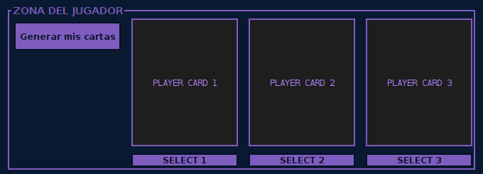

# YuguiHoApi
### Hecho por:
#### Sara Sofia Sánchez - 2359506
#### Johann Andrey Gonzalez - 2511006

## Instrucciones de Ejecución:

1. Al iniciar el juego, encontrá una pantalla con un tablero que indica el area del jugador y el area de la maquina
2. El jugador es el que debe generar sus cartar, en el boton elegir cartas

3. Si se inician generando las de las maquina, solicitara que se genere primero las del jugador

4. Cuando se generan las del jugador y las de la maquina, el duelo inicia al selecionar una carta por parte del jugador

   
5. La maquina sacara una carta al azar de las que tiene en su mano e inicia la batalla automaticamente. 
6. Las cartas que sean derrotadas se eliminan de la mano del jugador o de la maquina (depende de quien haya sido derrotado).
 
7. El juego termina cuando ya un jugador ha ganado dos rondas, si queda en empate ambas cartas no van a seguir en el juego.

## Explicación del diseño:

- Decicimos generar una GUI, que tenga tres Jpanes, uno con la información de la maquina, otro con la de la batalla y la ultima la del jugador
- En zona de la maquina encontraremos: tres curadros para las cartas de cada moustro y un boton para generarlas de forma aleatoria:

- En la zona de batalla, encontraremos dos recuadros que indican la carta del jugador y de la maquina que estan compitiendo.
   
- Por ultimo en la zona del jugador encontrarmos tres recuadros para las cartas y un boton para generarlas

- El diseño completo se ve de la siguiente forma:

